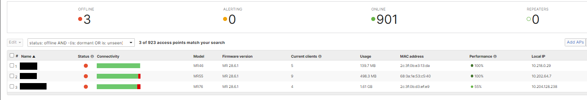
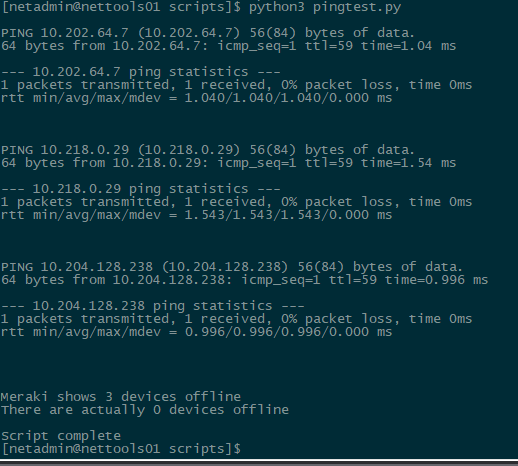

# MerakiPing

---

Python script to verify Meraki wireless access points are online

---

Recently Cisco has been having issues with its cloud-based dashboard, Meraki. There have been cases where hundreds of wireless access points would appear as offline and alert our team. We would investigate the issue only to find that each AP was actually online and passing traffic, but there was an error in the dashboard. Investigating these occurrences every day became tedious, so I created this script. The script interfaces with the Meraki dashboard API and gets all the wireless access points in our network with the "offline" status and pings them to see if they are online.

There is an edge case where the DHCP server could hand out the AP's IP address to another device, leaving the LAN IP for the AP incorrect, resulting in a false-positive ping. This issue can be addressed by comparing the device's mac to the AP's mac to verify they are the same. This wasn't implemented since, in our environment, those APs would retain those IPs for 24 hours, and we would notice the issue within that time frame.


I created a batch file (not in this repo) that can be used by coworkers running a Windows OS. The batch file reaches out to a server that hosts the script and executes it.

---

## Prerequisites

To run the script it is suggested to have at least:
* Python 3.7 or higher

The script depends on the Meraki Dashboard API Python Library, which can be installed with pip.

Example:
```$ pip3 install --upgrade meraki```

More information on this library can be found on the official GitHub [here](https://github.com/meraki/dashboard-api-python)

---

## Credentials

There are sections in the script for an API key and an organization ID. These can be created/found in the Meraki dashboard.

---

## Example usage:

### Dashboard


### Output
